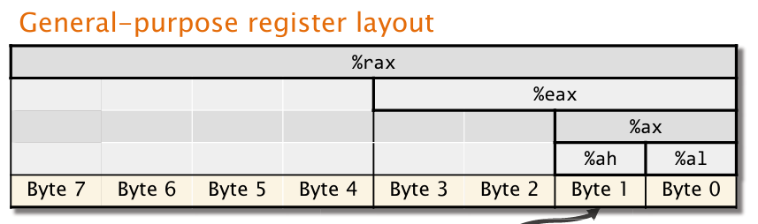
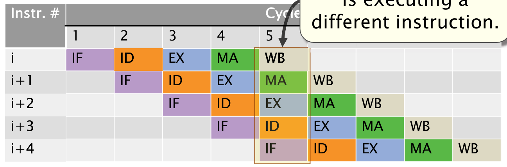

# Lecture 4: Assembly Language and Computer Architecture

- Compilation involves four major steps: preprocessing, compiling, assembling, linking
  - View preprocessor output: `clang -E`
  - View compiler output: `clang -S`
  - View assembler output: `clang -c` (object file)
  - Link with `ld`
- x86-64 general-purpose registers are aliased: each has multiple names
  
- Instruction format: `<opcode> <operand_list>`
- Two syntaxes: AT&T and Intel&reg;
- Operand suffixes may describe data type of operation or condition code
  - If missing, can usually be inferred from sizes of operand registers
- Results of 32-bit operations are implicitly zero-extended to 64-bit values unlike 8- and 16-bit operations
- Direct addressing modes: immediate, register, direct memory
- Indirect addressing modes: register indirect, register indexed, intruction-pointer relative
- Modern x86-64 architectures support scalar floating-point arithmetic via different instruction sets
  - SSE and AVX instructions: supports single- and double-precision scalar floating-point arithmetic (along with vector instructions)
  - x87 instructions: supports single=, double-, and extended-precision scalar floating-point arithmetic
- SSE instructions use two-letter suffixes to encode the data type: first letter distinguishes **s**ingle or **p**acked, second letter distinguishes **s**ingle-precision or **d**ouble-precision
- Vector registers hold `k` scalar integer or floating-point values
- Vector units contain `k` vector lanes containing integer or floating-point hardware
- All vector lanes operate in lock-step and use same instruction and control signals
- Vector instructions generally operate in an elementwise fashion
  - `i`th element of one vector register can only take part in operations with `i`th element of other vector registers
  - Depending on architecture, vector memory operands might need to be aligned (address must be multiple of vector width)
  - Some architectures support cross-lane operations such as inserting/extracting subsets of vector elements
- Modern x86-64 architectures support multiple vector-instruction sets (AVX, AVX2, AVX-512/AVX3)
  - XMM and YMM registers are aliased
- AVX/AVX2 instruction sets extend the SSE instruction set
  - AVX/AVX2 opcodes add `v` prefix to SSE opcodes
- Architectural improvements
  - Exploit parallelism by executing multiple instructions simultaneously (e.g. instruction-level parallelism, vectorization, multicore)
  - Exploit locality to minimize data movement
- Pipelined instruction execution: finds opportunities to execute multiple instructions simultaneously in different pipeline stages
  - Improves processor throughput:
    
- Hazards may prevent instruction executing during designated clock cycle:
  - Structural hazard: two intructions attempting to use same functional unit simultaneously
  - Data hazard: instruction depends on result of prior instruction in pipeline
  - Control hazard: fetching and decoding next instruction delayed by decision about control flow
- Data hazards can be created due to dependence between instructions:
  - True dependence (RAW): instruction `i` writes to location that instruction `j` reads
  - Anti-dependence (WAR): instruction `i` reads a location that instruction `j` writes
  - Output-dependence (WAW): both instructions `i` and `j` write to same location
- Some arithmetic operations are complex to implement in hardware and have long latencies (e.g. multiplication)
  - Complex pipelining uses separate functional units for complex operations
- Processor further exploits ILP by fetching and issuing multiple instructions per cycle to keep units busy (simpler operations: micro-ops)
- Bypassing allows instruction to read arguments before being stored in a GPR
- Model data dependencies between instructions as data-flow graph
- Processor mitigates performance loss of data hazards using two techniques:
  - Register renaming removes WAR and WAW dependencies
  - Out-of-order execution reduces performance lost due to RAW dependenices
- Issue stage tracks data dependenices between instructions dynamically using circular reorder buffer (ROB)
- Typically, only true (RAW) dependencies affect performance
- When processor encounters a conditional jump, outcome of branch (known after execute stage) is needed for instruction-fetch stage
  - Either stalls or speculatively executes past it
  - Effect on throughput of undoing computation is akin to stalling
  - Mispredicted branch costs many many cycles
- Modern processors use branch predictors to increase effectiveness of speculative execution
  - Fetch stage dedicates hardware to predicting branch outcomes
  - Modern branch predictors are accurate over 95% of times
- Hardware maintables table mapping branch instruction addresses to predictions of their outcomes (encoded as 2-bit saturating counter)
  - Counter updated based on actual outcome (taken &rarr; increase counter, not taken &rarr; decrease counter)
- Branch predictors are pretty proprietary and are hard to know about
