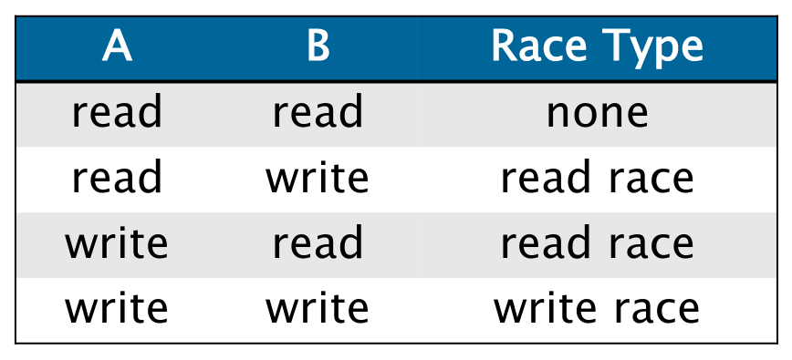

# Lecture 7: Races and Parallelism

- Race conditions are bane of concurrency
- Determinacy race: occurs when two logically parallel instructions access same memory locations and at least one writes
- Independent code: no determinacy races between two sections of code
  
- Machine word size matters (watch out for races in packed data structures)
- Parallel instruction stream is a dag: $G=\left(V,E\right)$
- Amdahl's "Law": if fraction $\alpha$ of an application must be run serially, speedup can be at most $1/\alpha$
- Span: critical-path length/computational depth
- Performance measurements:
  - Work law: $T_P\geq T_1/P$
  - Span law: $T_P\geq T_\infty$
- Series composition:
  - Work: $T_1\left(A\cup B\right)=T_1\left(A\right)+T_1\left(B\right)$
  - Span: $T_\infty\left(A\cup B\right)=T_\infty\left(A\right)+T_\infty\left(B\right)$
- Parallel composition:
  - Work: $T_1\left(A\cup B\right)=T_1\left(A\right)+T_1\left(B\right)$
  - Span: $T_\infty\left(A\cup B\right)=\text{max}\left\{T_\infty\left(A\right),T_\infty\left(B\right)\right\}$
- Speedup on $P$ processors: $T_1/T_P$
  - If $T_1/T_P<P$: sublinear speedup
  - If $T_1/T_P=P$: (perfect) linear speedup
  - If $T_1/T_P>P$: superlinear speedup
- Calculate parallelism benefits via Work/Span ratio
- Greedy scheduling: do as much as possible on every step (achieves $T_P\leq T_1/P+T_\infty$)
- Parallel slackness: $T_1/\left(PT_\infty\right)$
- In Clik runtime, each worker (processor) maintains work deque of ready strands
  - Workers steal from top of victim's deque
  - With sufficient parallelism, workers steal infrequently &rarr; linear speedup
