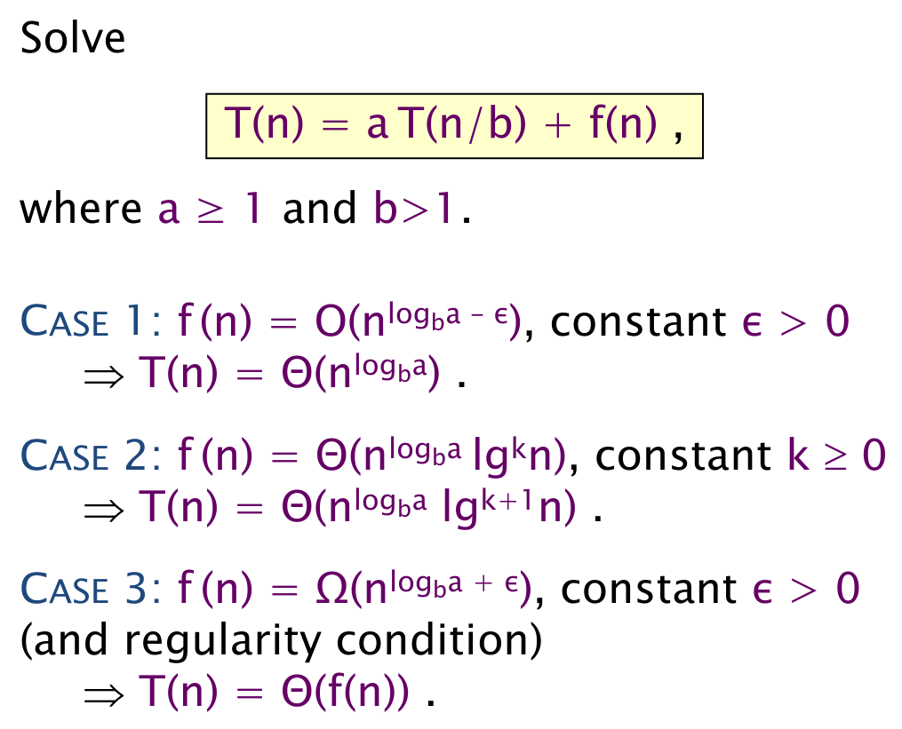

# Lecture 8: Analysis of Multithreaded Algorithms

- Master-method used to analyze recursive algorithms
  
- Performance tips:
  - Minimize span to maximize parallelism
  - If lots of parallelism, trade some to reduce work overhead
  - Use divide-and-conquer or parallel loops rather than spawning (e.g. `cilk_for` better than `cilk_spawn`)
