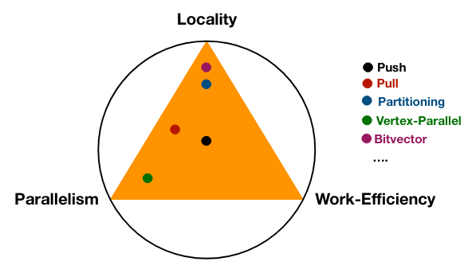

# Lecture 18: Domain Specific Languages and Autotuning

- Optimization tradeoff space exists between locality, parallelism, and work efficiency
  
- Autotuners can self-optimize (e.g. machine learning techniques for data processing)
